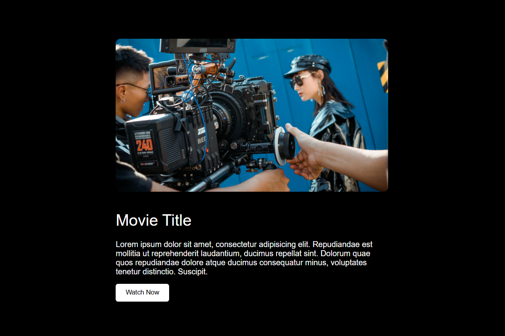

# 🎬 Video Trailer Popup  

A simple and interactive **Video Trailer Popup** project built using **HTML, CSS, and JavaScript**.  
This project displays a movie/video trailer in a popup modal when the user clicks the play button.  

---

## 🚀 Features  

✔️ Play trailer in popup modal 🎥  
✔️ Close button (❌) to hide trailer  
✔️ Background overlay effect 🌌  
✔️ Responsive and user-friendly design 📱💻  

---

## 🛠️ Tech Stack  

- **HTML5**  
- **CSS3 (Flexbox + Styling)**  
- **JavaScript (DOM Manipulation + Event Handling)**  

---

## 📸 Screenshot  

  

---
